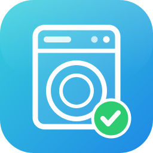

<p align="center">
  
</p>

# Dishwasher Duty

[](https://github.com/hacs/integration)

> Verfolgt, **wer die Spülmaschine ausräumt**, vergibt (ggf. anteilige) Gutschriften an
> Personen und erstellt detaillierte Statistiken.
>
> *Tracks **who unloads the dishwasher**, awards (optionally shared) credit to people and
> builds detailed statistics.* (English summary at the bottom.)

---

## 🇩🇪 Deutsch

**Dishwasher Duty** beobachtet einen vorhandenen Sensor (z. B. den „Operation state"-Sensor der
**Home-Connect**-Integration). Sobald dieser von **Läuft → Fertig** wechselt, entsteht ein
„offener Zyklus", den berechtigte Personen per Knopfdruck oder Service „claimen" können. Die
Gutschrift von **1,0 pro Zyklus** wird – bei gemeinsamem Ausräumen – anteilig verteilt.

### Funktionen

- **Robuste Zyklus-Erkennung:** nur ein echter Übergang `Running → Finished` zählt
  (verhindert Doppelzählung bei `unavailable → Finished`, Glitches, Neustarts).
- **Gemeinsames Ausräumen (Co-Claim):** ein konfigurierbares Zeitfenster (Default 90 s), in
  dem weitere Personen demselben Zyklus beitreten; die Gutschrift wird fair geteilt
  (1 Person = 1,0; 2 = je 0,5; 3 = 0,34/0,33/0,33 → Summe immer 1,0).
- **Persistenz:** komplette Zyklus-Historie übersteht Neustarts (auch ein offenes Claim-Fenster
  inkl. Restlaufzeit).
- **Statistiken:** kumulierte Gutschriften pro Person plus Tag/Woche/Monat/Jahr; Recorder-/
  Langzeitstatistik-kompatibel für Verlaufsdiagramme.
- **Services & Buttons** zum bequemen Claimen, Korrigieren und Auswerten.
- Übersetzt in **Deutsch, Englisch, Spanisch, Norwegisch (Bokmål), Griechisch, Japanisch,
  Französisch**.

### Installation (HACS)

1. HACS → ⋮ → *Benutzerdefinierte Repositories* → dieses Repo als Kategorie **Integration**.
2. *Dishwasher Duty* herunterladen, Home Assistant neu starten.
3. *Einstellungen → Geräte & Dienste → Integration hinzufügen → „Dishwasher Duty"*.

> **Manuell:** Ordner `custom_components/dishwasher_duty/` nach `<config>/custom_components/`
> kopieren und HA neu starten.

### Einrichtung

| Feld | Bedeutung |
|---|---|
| **Quell-Sensor** | z. B. `sensor.dishwasher_operation_state` (Home Connect) |
| **„Fertig"-Wert** | State-Wert für „fertig" (Default `Finished` – **prüfe deinen Sensor!**) |
| **„Läuft"-Wert** | State-Wert für „läuft" (Default `Run`) |
| **Berechtigte Personen** | Mehrfachauswahl aus `person`-Entitäten |
| **Gemeinsames Ausräumen** | an/aus (Default an) |
| **Co-Claim-Fenster** | Sekunden (Default 90) |
| **Entprellung** | Sekunden (Default 0 = aus) |

> **Wichtig:** Der „Fertig"/„Läuft"-Wert hängt von Geräte- und HA-Version ab (z. B. `Finished`/
> `Run` oder klein geschrieben `finished`/`run`). Schau in *Entwicklerwerkzeuge → Zustände*
> nach, welchen State dein Sensor wirklich annimmt, und trage ihn ein.

### Erzeugte Entitäten

| Entität | Bedeutung |
|---|---|
| `sensor.dishwasher_duty_total_cycles` | Gesamtzahl aller Fertig-Zyklen (`total_increasing`) |
| `binary_sensor.dishwasher_duty_claimable` | `on`, solange der aktuelle Zyklus claimbar ist |
| `sensor.dishwasher_duty_<person>` | kumulierte Gutschriften je Person (+ Perioden-Attribute) |
| `button.dishwasher_duty_claim_<person>` | „Ich habe ausgeräumt"-Knopf je Person |

### Services

| Service | Beschreibung |
|---|---|
| `dishwasher_duty.claim` | `person` – aktuellen Zyklus claimen |
| `dishwasher_duty.claim_multiple` | `persons` – mehrere auf einmal (gleichmäßig) |
| `dishwasher_duty.cancel_claim` | `person` – eigenen Claim im offenen Fenster zurückziehen |
| `dishwasher_duty.get_statistics` | `start`,`end`,`person?` – Statistik als **Service-Response** |
| `dishwasher_duty.reset_statistics` | `person?` – Historie zurücksetzen (⚠️ löscht Daten) |

**Statistik-Beispiel (mit Antwort):**

```yaml
action: dishwasher_duty.get_statistics
data:
  start: "2026-01-01 00:00:00"
  end: "2026-12-31 23:59:59"
response_variable: stats
```

`stats` enthält dann `total_cycles`, `unclaimed_cycles`, `per_person`
(Beteiligungen + Summe der Gutschriften) und eine chronologische `timeline`.

### Beispiel-Dashboard

```yaml
type: vertical-stack
cards:
  - type: entities
    title: Spülmaschine
    entities:
      - entity: binary_sensor.dishwasher_duty_claimable
        name: Ausräumen offen?
      - entity: sensor.dishwasher_duty_total_cycles
        name: Zyklen gesamt
  - type: horizontal-stack
    cards:
      - type: button
        name: Luke war's
        entity: button.dishwasher_duty_claim_luke
        tap_action: { action: toggle }
      - type: button
        name: Leo war's
        entity: button.dishwasher_duty_claim_leo
  - type: history-graph
    title: Gutschriften
    entities:
      - sensor.dishwasher_duty_luke
      - sensor.dishwasher_duty_leo
```

### Standard-Entscheidungen (Defaults)

- **Eine Gutschrift pro Zyklus = 1,0.** Bei n Claimern: je `round(100/n)` Cent, Restcent an die
  ersten Claimer → Summe exakt 1,00.
- **Anteils-Timing:** Gutschriften werden dem Zeitpunkt des Claims (`claimed_at`) zugeordnet.
- **Fenster schließt** beim nächsten `Running` (nicht bei `unavailable`/`Ready`), damit du auch
  nach „Ready" noch claimen kannst.
- **Personen-Slug** = `object_id` der `person`-Entität (`person.luke` → `…_luke`).

### Edge Cases

`unavailable`/`unknown` werden nie als Lauf/Fertig gewertet; HA-Neustart stellt offene Fenster
inkl. Restzeit wieder her; Mehrfachdrücken ist idempotent (1 Beitrag je Person/Zyklus); ein
Tages-/Wochenwechsel verändert nur die Perioden-Attribute, nie die Gesamtsumme.

### Weiterführende Doku

- Technische Doku (EN): [`docs/TECHNICAL.md`](docs/TECHNICAL.md)
- Benutzerdoku: [`docs/user/`](docs/user) (de, en, es, fr, nb, el, ja)

---

## 🇬🇧 English (summary)

Dishwasher Duty watches a source sensor (e.g. Home Connect's *Operation state*). A valid
`Running → Finished` transition opens a claimable cycle; eligible `person` entities claim it via
button or service. The **1.0 credit per cycle** is shared among co-claimers within a configurable
window (default 90 s). The full cycle history is persisted (Store) and survives restarts; per-person
credit sensors are Recorder/long-term-statistics compatible. Services: `claim`, `claim_multiple`,
`cancel_claim`, `get_statistics` (response), `reset_statistics`.

Install via HACS (custom repository, category *Integration*) or by copying
`custom_components/dishwasher_duty/` into `<config>/custom_components/`, then add the integration
from *Settings → Devices & Services*. **Check your sensor's real "finished"/"running" state values**
in *Developer Tools → States* and enter them. See [`docs/TECHNICAL.md`](docs/TECHNICAL.md) and
[`docs/user/en.md`](docs/user/en.md).

## License

MIT
